 

  

 

## ⚡ whoami

<table>
<tr>
<td width="60%" valign="top">

I'm Sangam — a full-stack developer who ships complete products solo: backend, frontend, data, and the small design details most people skip.

- 🛠️ **Backend:** Java 21, Spring Boot 3.x, PostgreSQL, event-driven design
- 🎨 **Frontend:** React 19, TypeScript, GSAP, Framer Motion — I care as much about the animation curve as the API contract
- 🌏 **Roots:** based in Tamil Nadu, India, with several projects built around Nepal's data and fintech landscape
- 🚀 **Currently:** building [**CrisisConnect**](#-crisisconnect), a disaster-response platform with an AI verification engine on top of the Claude API
- 🕹️ **Signature move:** if you've seen a rotary telephone with animated smoke on one of my sites — that's mine

</td>
<td width="40%" valign="top" align="center">

**Toolbelt**

</td>
</tr>
</table>

 

## 🚧 what I'm building

<b>🚨 CrisisConnect — disaster response SaaS</b>

 

A platform for coordinating disaster response in real time: incident reporting, an admin command dashboard, live routing, and an AI verification layer that screens incoming reports.

| | |
|---|---|
| **Backend** | Spring Boot 3.3 · Java 21 · event-driven verification via `TransactionalEventListener` |
| **Frontend** | React 19 · Leaflet + STOMP WebSockets for the live map |
| **Routing** | Mapbox, with a Haversine fallback exposed via a `source` field |
| **AI layer** | Claude API verification engine with retry logic and a dedicated `VERIFICATION_FAILED` state |
| **Status** | MVP delivered, multi-tenant schema in place, billing schema-ready |

<b>🧑‍💻 Portfolio site — Vite + React 19 + TypeScript</b>

 

My personal site, rebuilt from the ground up: pinned GSAP ScrollTrigger hero, Framer Motion project modals, dual opposing marquee skill rows, and the rotary-telephone-and-smoke contact section carried over from an earlier cyberpunk build.

`GSAP` `Framer Motion` `EmailJS` `react-icons` — dark-mode-first, amber (`#F59E0B`) on zinc.

<b>🗺️ Nepal Job Market Visualizer</b>

 

A zero-dependency, single-file treemap of Nepal's labor market: 96 occupations across 16 sectors (~7.6M workers), with switchable color layers for growth outlook, median pay, education, and AI exposure. Built on Nepal Labour Force Survey, ILO/World Bank, and NRB remittance data.

<b>💬 NeuralChat — multi-model AI chat app</b>

 

A chat interface for comparing multiple LLMs side by side. React frontend, Node.js backend, MongoDB + Redis, WebSocket streaming with stop-generation support.

<b>🔐 TrustKYC AI — fintech fraud-detection engine</b>

 

Hackathon build: a two-phase KYC risk engine (weighted 0–100 score + 16 hard override rules) using the Claude Vision API for document and face verification, with an eSewa-themed variant for Nepal-specific ID formats.

 

## 📊 the numbers

 

<b>🏆 trophy case</b>

 

 

## 🐍 the contribution snake

a snake, eating a year of commits — regenerated on autopilot, see <a href="./.github/workflows/snake.yml">.github/workflows/snake.yml</a>

 

## 📡 connect

  

